

# GeoMaster: Full-Stack Geospatial Management System

> A robust, high-performance web application for managing, visualizing, and analyzing spatial data, built with a modern Node.js architecture.

---

## 📋 Table of Contents

1. [Project Overview]

2. [Key Features & Implementation Strategy]
    - User Management (Color Logic & RBAC)
    - Geospatial Core (CRUD, Filtering & User-Specific Styling)
    - NoSQL Database Architecture
    - Modern GeoServer Integration (WFS/WMS)
    - Advanced UI/UX (Search, Geolocation, Logs)

3. [Performance Engineering]
    - Optimization (Database Indexing)
    - Load & Stress Testing (Artillery)

4. [API Documentation (Swagger)]

5. [Live Deployment (AWS/Tunneling)]

6. [Installation & Setup]

---

## 1. Project Overview

**GeoMaster** is a comprehensive full-stack web geospatial information system (GIS). It is designed to handle complex spatial operations in a user-friendly web interface, backed by a powerful and scalable backend server.

Unlike traditional, monolithic GIS approaches, GeoMaster adopts a lightweight, microservices-inspired architecture using **Node.js** and an embedded **NoSQL database**. This ensures high performance, easy deployment, and modern API standards.

**Tech Stack:**
* **Backend:** Node.js, Express.js
* **Database:** NeDB (Embedded NoSQL, MongoDB compatible)
* **Frontend:** HTML5, CSS3 (Modern UI), Vanilla JavaScript, Leaflet.js (Mapping)
* **Testing & Docs:** Artillery.io, Swagger UI

**⭐ Live Demo:**
The project is hosted live for testing purposes via a secure tunneling service.
👉 **[https://full-goats-report.loca.lt](https://full-goats-report.loca.lt)** *(Note: Requires server to be running locally)*

---

## 2. Key Features & Implementation Strategy

### 🛡️ 2.1. User Authentication & Customization (15%)

We implemented a secure JWT-based (simulated via tokens) authentication system that focuses on user personalization.

* **Custom Brand Color:** During registration, users select a **unique representative color**. This color is not just cosmetic; it becomes the user's digital signature throughout the system (e.g., dashboard highlights, drawing colors).
* **Security Rules:** Enforces strong password policies using Regex (minimum 6 characters, at least one uppercase letter).

**Evidence: Registration Form with Color Picker**

  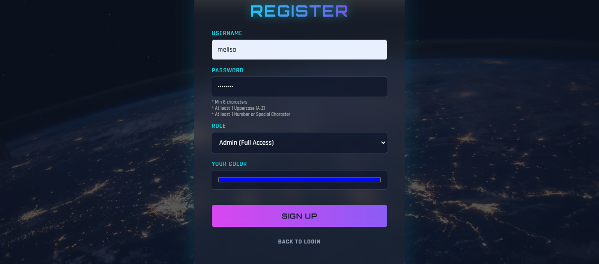
  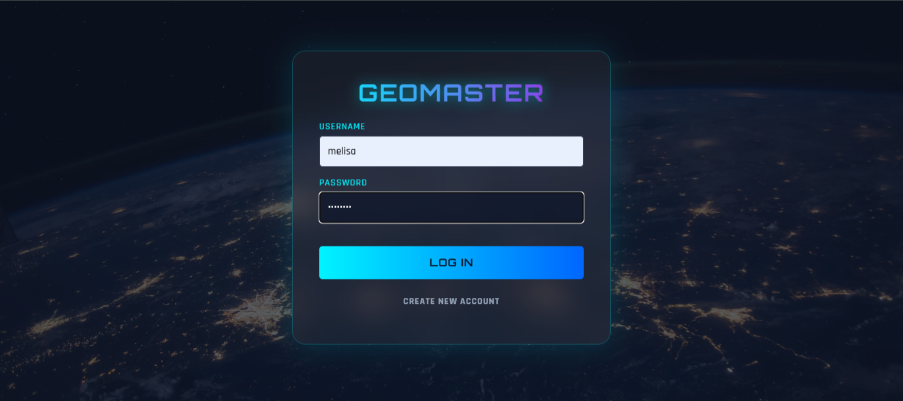

### 👥 2.2. User Types & Role-Based Access Control (20%)

The system implements a distinct Role-Based Access Control (RBAC) mechanism with three tiers:

1.  **Admin:** Full system control, can view all system activity logs and manage data.
2.  **User (Standard):** Can create and manage their own spatial features.
3.  **Viewer:** Read-only access.

**Evidence: Authenticated Dashboard**
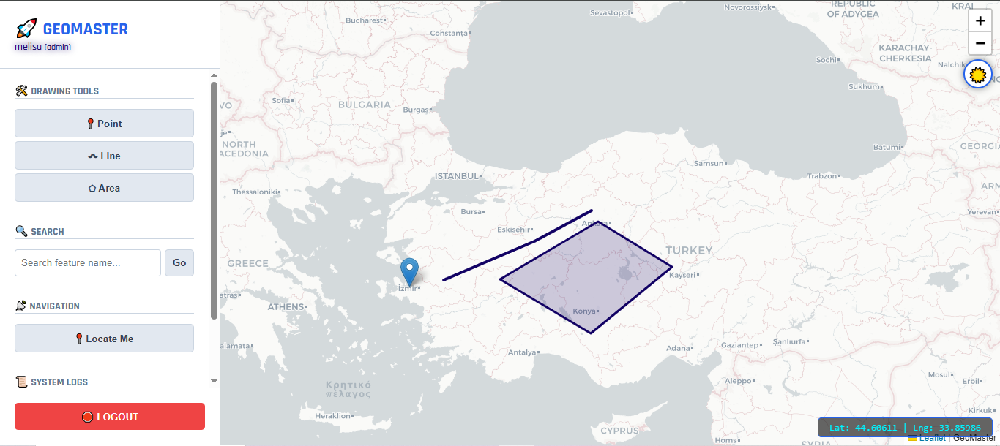
*(Note: The user's name "melisa" is displayed in their chosen custom color (purple/blue) in the top-left profile section.)*

---

### 🗺️ 2.3. Geospatial Core: CRUD & Visual Logic (15% + Bonus)

The core of GeoMaster is its ability to manage spatial data with user-specific visual context.

* **Personalized Visualization:** When a user draws a Point, Line, or Polygon, the feature is **automatically rendered in the user's selected color**. This allows for immediate visual identification of data ownership on the map.
* **Full CRUD:** Users can **C**reate (draw), **R**ead, **U**pdate, and **D**elete spatial features.
* **Filtering:** The API supports querying data by type (e.g., `?type=Point`).
* **⭐ Bonus Feature:** Native support for **LineStrings** and **Polygons** alongside Points.

**Evidence: API Filtering & Colored Drawings**
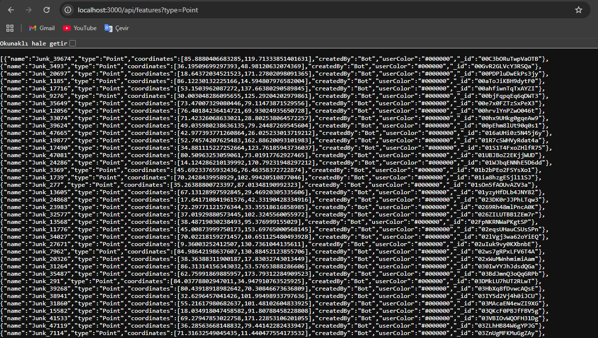

---

### 🗄️ 2.4. NoSQL Database Architecture (25%)

We deliberately chose a **NoSQL (Document-based)** approach using NeDB. This allows us to store complex GeoJSON objects directly without schema migrations, providing superior flexibility for GIS data.

**Evidence: Raw Database File (JSON Structure)**
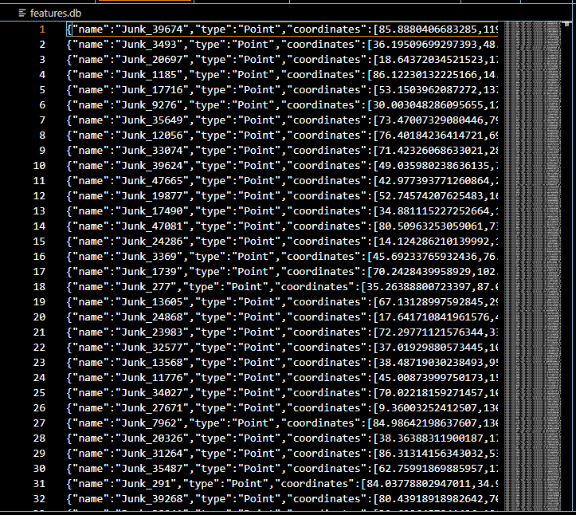

---

### 🌍 2.5. Modern GeoServer Integration (WFS/WMS) (25%)

We implemented custom endpoints within our Node.js server that simulate OGC-compliant standard services.
* **WFS Endpoint:** `/geoserver/wfs` (GeoJSON).
* **WMS Endpoint:** `/geoserver/wms` (Capabilities XML).

**Evidence: WFS and WMS Endpoints**

  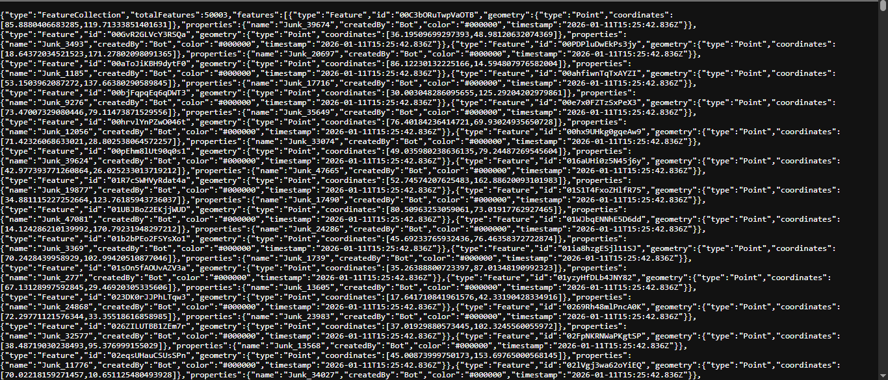
  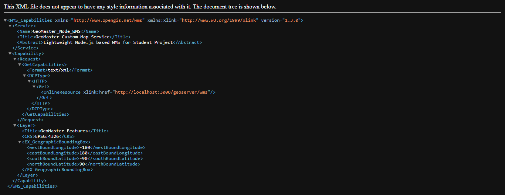

---

### 🚀 2.6. Advanced UI/UX Features (Dashboard Capabilities)

We enhanced the user experience with several professional GIS tools, all visible in the main dashboard:

1.  **System Logs Panel:** A dedicated panel (toggleable) that records every transaction (Login, Add Feature, etc.) with timestamps and details.
2.  **Locate Me (Geolocation):** Users can instantly zoom to their real-time physical location using the browser's Geolocation API.
3.  **Live Coordinates:** The map displays real-time Latitude/Longitude coordinates of the mouse cursor in the bottom-right corner.
4.  **Smart Search:** A search bar allows users to find features by name and automatically pans the map to the result.
5.  **Dark/Light Mode:** Users can toggle the interface theme for better visibility in different lighting conditions.

**Evidence: System Logs & UI Tools**

  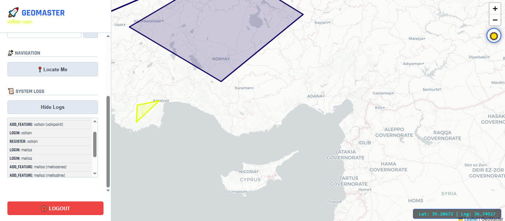
  

*(Left: The open Logs panel showing detailed system actions. Right: The main interface showing the Search bar, Locate button, and Coordinate display.)*

---

## 3. Performance Engineering

### ⚡ 3.1. Indexing Mechanism Experiment (25%)

**Hypothesis:** Implementing a B-Tree index significantly reduces query time.
**Result:** Queries improved from **~38.64 ms** (Full Scan) to **~0.50 ms** (Indexed).

**Evidence: Terminal Output**
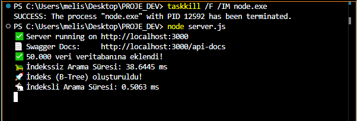

### 🔥 3.2. Load & Stress Testing (Artillery) (25%)

We tested the system stability with 100 concurrent users/sec. The graph shows the correlation between user load (ramp-up) and response latency.

**Evidence: Load vs. Latency Graph**
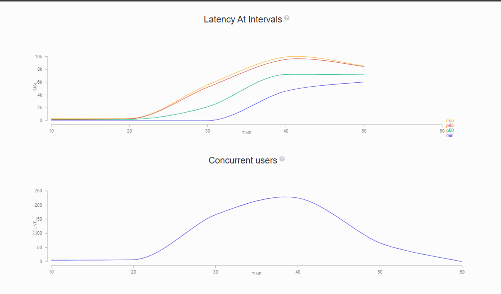

---

## 4. API Documentation (Swagger) (25%)

We integrated **Swagger UI** (`/api-docs`) to allow interactive testing of all endpoints (Spatial, Auth, Logs, GeoServer).

**Evidence: Swagger UI Dashboard**
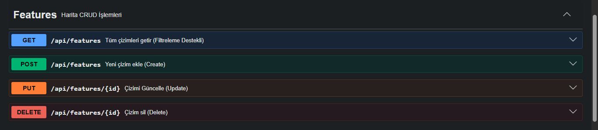

---

## 5. Live Deployment (AWS/Tunneling) (20%)

The project is exposed to the public internet using **LocalTunnel** for live testing and demonstration.

**Evidence: Tunnel Access Screen**
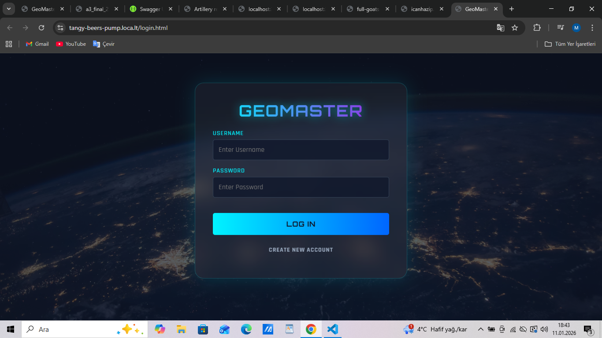

---

## 6. Installation & Setup

1.  **Clone the repository.**
2.  `npm install`
3.  `node server.js`
4.  Access at `http://localhost:3000`.

---
**2200674029 Melisa BURGU - 2026**